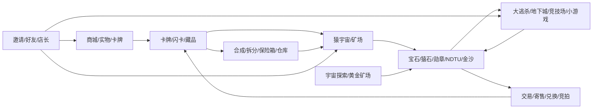

# 01 — 完整产品生态与大循环

## 原产品不是“一个游戏”，而是一个由多个资产池连接的游戏化平台

## 一级入口建议照搬成 5 个主 Tab
1. **潮玩**：商城、盲盒、福袋、卡牌、抽签、数字潮玩。
2. **猿宇宙**：猿卡、矿场、宝石、猿石、勋章、地下城、竞技场。
3. **游戏**：大逃杀、匕首、抢夺、斗猿场、虎口逃生、吃鸡、弹珠、运动会、拔河、炸猴王等。
4. **交易**：卡牌/徽章/猿石/矿石/匕首/数字潮玩的寄售、交易记录、竞拍。
5. **我的**：资产、钱包、仓库、保险箱、订单、物流、邀请、好友、设置。

## 资产体系
- 宝石 Gemstone：矿场、竞技、小游戏、交易的核心中间资产。
- 勋章 Medal：抽卡/兑换/小游戏/宝石相关系统的另一核心资产。
- NDTU：飞船/宇宙类玩法及兑换。
- 世界币 WorldCoin：历史生态资产。
- 猿石 ApeStone：猿宇宙/猿石魔兽/宝石兑换关系。
- 金沙 Sand：矿场/黄金相关生产资产。
- 黄金 Gold：黄金矿场与精炼。
- 匕首 Dagger：大逃杀失败后的衍生资产，用于刺杀/抢劫杀手体系。
- 无聊猿卡 ApeCard / 星球卡 PlanetCard / 闪卡 FlashCard / 徽章 Badge：持有、生产、组合、拆分、仓储、交易。
- 积分 Integral / 红包进度 RedPacketProgress：任务、分解、活动型奖励。

## 留存循环
登录 → 收矿/收产出 → 看资产变动 → 参与一局高刺激玩法 → 获得/损失资产 → 去交易或补充资产 → 做任务/邀请 → 回到矿场或游戏。

这才是原 APK 的主循环，上一版只取其中一个小游戏，确实会显得单薄。
